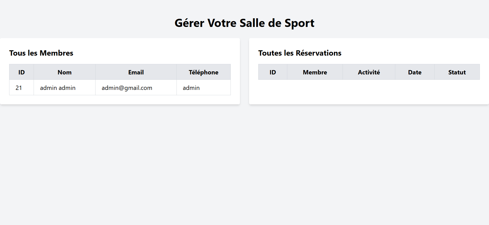
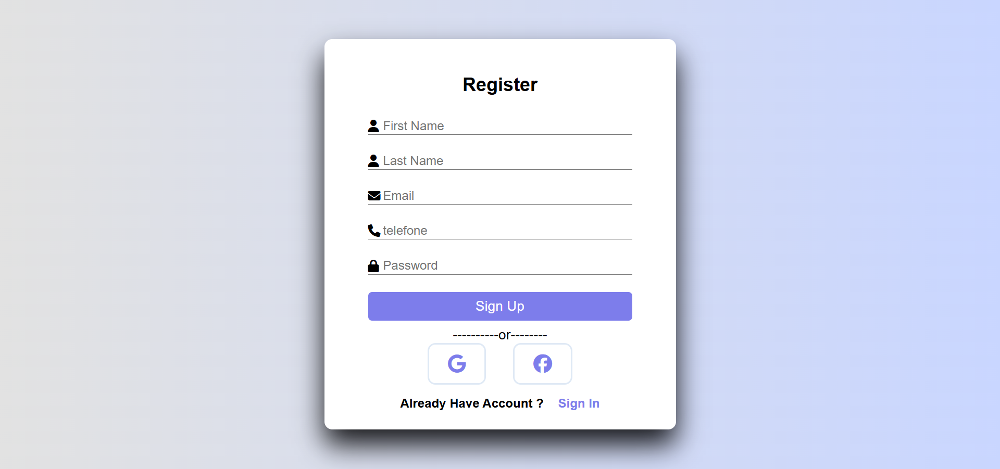
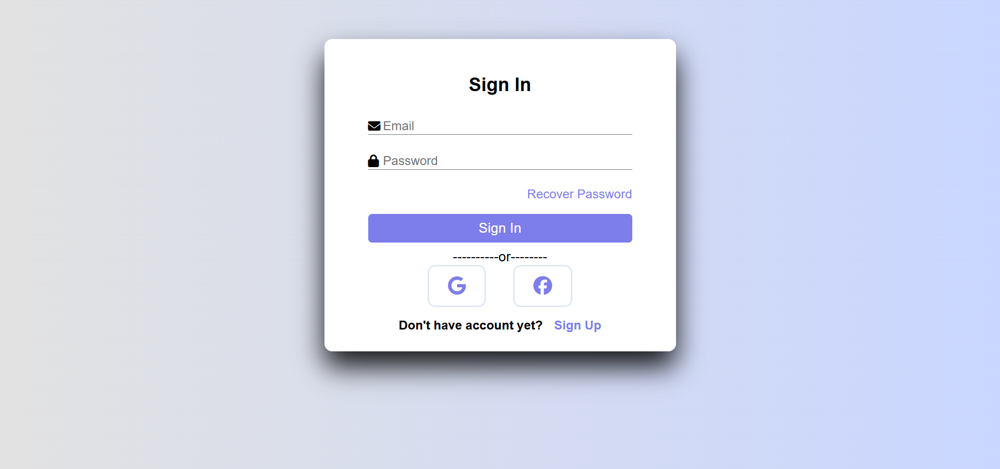

# Projet : Application Web de Gestion d'une Salle de Sport

## Contexte du Projet
Une salle de sport souhaite moderniser son système de gestion en remplaçant les opérations manuelles par une application web. Cette solution permettra de :

- Gérer les membres inscrits à la salle.
- Planifier et afficher les activités ou équipements disponibles.
- Permettre aux membres de réserver des activités ou des équipements.

## Objectifs
Vous avez pour mission de :
1. Concevoir une base de données et la modéliser.
2. Développer les fonctionnalités essentielles en PHP.
3. Créer des scripts SQL pour manipuler les données.
4. Fournir une documentation complète pour l'installation et l'exécution du projet.

---

## Liens Importants
- **Hébergement** : [Application en ligne](https://9c90-197-230-250-154.ngrok-free.app/)
- **Répertoire GitHub** : [Gestion de Salle](https://github.com/Abdelmoudiri/gestion-du-salle.git)
- **Cahier des Charges** : [Miro Board](https://miro.com/app/board/uXjVL5_Ddg0=/)

---

## Livrables

### 1. Modélisation (1er jour)
- **Diagramme ERD** : Modélisation de la base de données selon le schéma fourni.
- **Diagramme UML** : Diagramme de cas d’utilisation identifiant les acteurs et leurs interactions.

### 2. Scripts SQL (3e jour)
- Scripts pour :
  - Créer les tables de la base de données.
  - Insérer, mettre à jour et supprimer des données.
  - Effectuer des jointures simples entre tables.

### 3. Code PHP (5e jour)
- **Fonctionnalités principales** :
  - Formulaires pour ajouter des données (membres, activités, réservations).
  - Affichage dynamique des données (listes des membres, réservations, etc.).
- **Bonus** :
  - Modification et suppression de données.
  - Recherche avancée par critères (ex. activité).

### 4. Documentation
- Instructions complètes pour :
  - Installer et configurer l’environnement.
  - Lancer et tester l’application.

---

## Configuration de l'Environnement

### Prérequis
- **Serveur local** : XAMPP, WAMP ou autre.
- **PHP** : Version 7.4 ou supérieure.
- **Base de données** : MySQL.
- **Navigateur web** : Chrome, Firefox, etc.

### Installation
1. Clonez le dépôt GitHub :
   ```bash
   git clone https://github.com/Abdelmoudiri/gestion-du-salle.git
   ```
2. Importez la base de données en utilisant le fichier SQL fourni.
3. Configurez le fichier `config.php` avec vos paramètres de connexion à la base de données.
4. Lancez le serveur local et accédez au projet via l'URL correspondante.

---

## Fonctionnalités Développées

### Membres
- Ajout de membres via formulaire.
- Affichage de la liste des membres.

### Activités
- Gestion des activités disponibles.
- Affichage des activités planifiées.

### Réservations
- Système de réservation simple.
- Recherche de réservations par critères.

---

## Ajout de Screenshots
Ajoutez ici des captures d'écran de l'interface utilisateur pour illustrer les fonctionnalités principales.
## Interface Utilisateur

### Page d'accueil


### Liste des membres


### Formulaire d'signUp


### Formulaire d'logIN


---

## Auteur
Projet réalisé par Abdeljabbar Moudiri dans le cadre d'une mission autonome. Pour toute question, contactez-moi via [GitHub](https://github.com/Abdelmoudiri).

---

## Licence
Ce projet est sous licence MIT. Veuillez consulter le fichier `LICENSE` pour plus de détails.

